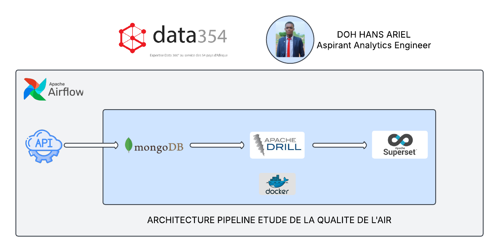

# Air_quality_project_data_354
Projet consistant à mettre en place un ETL pour l'étude de la qualité de l'air

## Prérequis 
Docker : https://docs.docker.com/get-docker  
Docker compose : https://docs.docker.com/compose/install  
Python : https://www.python.org/downloads  
Git : https://git-scm.com/downloads  
Une fois installés, lancer docker

## Installation et lancement du projet 
git clone https://github.com/HansDoh2404/air_quality_eng_data_354.git  
cd air_quality_eng_data_354  
pip install -r requirements.txt  
docker-compose up --build -d 
cd scripts  
pip install pymongo (si vous rencontrez l'erreur No Module found : pymongo) 
python3 extract_data.py  
python3 calcul_avg_polluant.py  
cd .. 
docker cp ./superset.db.backup superset:/app/superset_home/superset.db  
sudo chown -R 50000:50000 ./logs  
sudo chmod -R 775 ./logs (pour éviter des erreurs de permissions sur les logs)

## Connexions aux différents serveurs
**Allez aux adresses suivantes :**
### localhost:8082 pour avoir accès à Airflow (orchestration) :
username : airflow, login : airflow  
Activer les différents jobs si ce n'est pas le cas   
Trois jobs sont visibles : 
- daily_polluant_averages : pour le calcul des différentes moyennes journalières des polluants  
- extraction_by_hour_dag : pour l'extraction des données horaires des différentes stations  
- forecasting_by_hour : pour le forecasting sur les deux prochaines heures  
### localhost:8047 pour avoir accès à Drill (connecteur à superset) :
- Aller dans Storage :
  Dans la liste des plugin, choisissez mongo en appuyant sur le bouton update  
  Modifier le champ "connection" en remplaçant localhost par mymongodb (assurez-vous d'utiliser le port 27017)  
  Cliquer sur Enable puis Update (une notification de succès devrait normalement apparaitre à chaque fois)   
- Aller dans Query :  
  Entrer : SHOW SCHEMAS; (vous devrez voir mongo.air_quality)  
  Revenez dans Query puis entrez : USE mongo.air_quality;
### localhost:8091 pour avoir accès à Superset (visualisation) :
username : admin, login : admin  
 - Si vous avez la visibilité directement sur les dashboards : visualisez les et appréciez les  
 - Sinon : 
    Aller dans Settings > Database Connection > Sélectionnez Apache Drill (parmis la liste des bd qui apparaitront)  
    Entrer la chaine de connection suivante : drill+sadrill://drill:8047/mongo.air_quality  
    Cliquez sur test connection (pour vous assurer que la connection fonctionne normalement) 
    Puis cliquez sur connection 
    Après cela vous devrez être en mesure de voir le dashboard AIR_QUALITY_DASHBOARD ainsi que les diagrammes  
  - Au cas où une erreur apparait au niveau des diagrammes, raffraichissez la page (plusieurs fois s'il le faut) jusqu'à ce que l'erreur disparaisse   

**N.B : Le job de forecasting génère un fichier predictions.txt que vous pourrez trouver dans dags/ml**

## Architecture du projet
L'architecture du projet repose sur plusieurs composants demandés et d'autres que nous avons ajoutés pour atteindre les objectifs :

Base de données : MongoDB.  
Visualisation : Apache Superset  
Driver de connexion entre Superset et MongoDB : Apache Drill  
Orchestration des tâches ETL : Apache Airflow  
Modèle de Forecasting : Python (basée sur la librairie Prophet)   

**Ci-dessous l'image de l'architecture :**   

  
  

